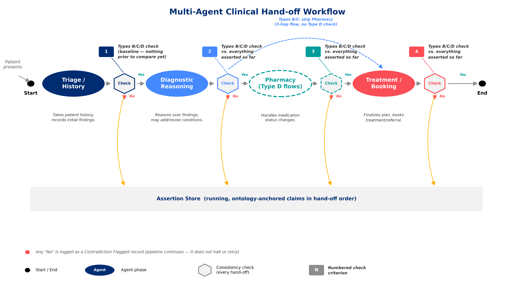
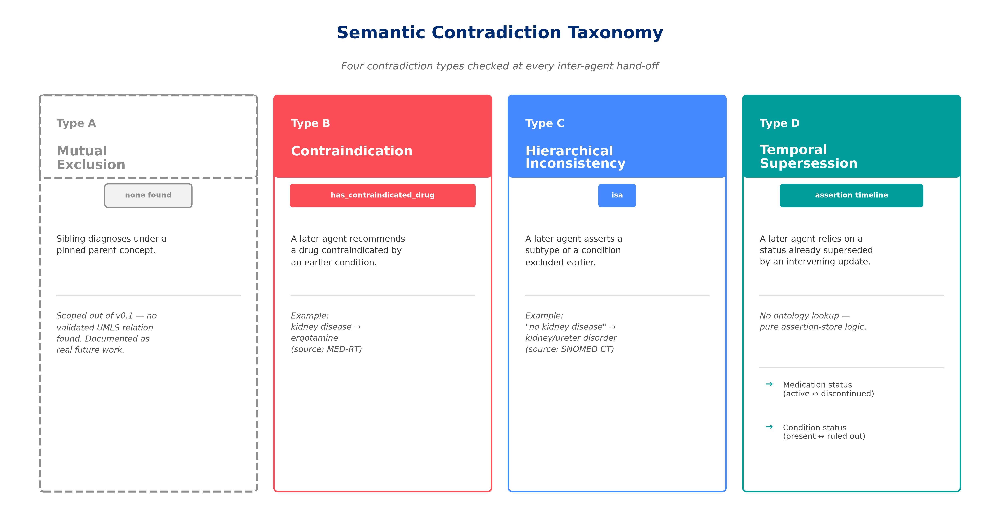

# Inter-Agent-Verification# Inter-Agent Consistency Verification

**A semantic contradiction taxonomy and ontology-grounded verifier for
multi-agent clinical AI hand-offs.**

Multi-agent clinical AI pipelines (triage → diagnosis → treatment, etc.)
have no built-in mechanism to catch a later agent silently contradicting
what an earlier agent already established. Existing systems check
whether a single agent's output is *individually* grounded in a
knowledge base, but every claim in a real hand-off contradiction is,
on its own, perfectly valid. The contradiction exists only in the
*relationship between hand-offs*, which single-agent grounding cannot
see by construction.

This project builds and empirically validates an inter-agent consistency
checker that catches exactly that failure class, using real UMLS/SNOMED
CT/MED-RT ontology relations plus assertion-store timeline logic — not
just an argument for why it should work, but a working system tested
against a real benchmark.



## Headline result

| | Clean (templated) text | Naturally rephrased text |
|---|---|---|
| **Catch rate** | 100.0% | 84.4% |
| **False positive rate** | 0.0% | 0.0% |

Measured on an 82-case benchmark (45 positive / 37 negative), spanning
three implemented contradiction types, mined from real UMLS data. Every
number here is reproducible from the scripts in this repo — see
[Reproducing the results](#reproducing-the-results) below.

**Ablation (the core claim, directly tested):** a single-agent-grounding
baseline — the mechanism used by prior art — catches **0%** of the same
45 positive cases on clean text. This project's inter-agent checker
catches all of them. The full comparison, including a privileged
regex baseline, is in `tables/Table2.png`.

## The taxonomy



## Architecture

A 3–4 agent hand-off pipeline (Triage/History → Diagnostic Reasoning →
[Pharmacy, Type D flows only] → Treatment/Booking). At every hand-off,
the new agent's claim is extracted, anchored to a UMLS concept, and
checked against everything already asserted in the session; not just
the immediately prior agent. See `figures/figure1_architecture.png`
and `figures/figure3_pipeline.png`.

```
Agent free text
   -> Claim extraction (local LLM - Ollama, llama3.1:8b)
   -> Structured claim (subject, predicate, object, negated)
   -> Ontology anchoring (UMLS -> SNOMED CT / MED-RT)
   -> Assertion store (session timeline, hop-ordered)
   -> Consistency checker (Types B, C, D)
   -> Contradiction flagged, or pass
```

## Repository structure

```
core/          Shared pipeline modules (models, UMLS client, extractor,
               assertion store, checker): imported by everything else
scripts/       Everything you run (benchmark generation, evaluation,
               baselines, figures, tables)
exploratory/   One-off UMLS investigation scripts, kept for transparency
data/          Generated benchmark cases and results (JSON) 
figures/       Generated architecture/taxonomy/pipeline diagrams (PNG)
tables/        Generated results tables (PNG)

```

## Setup

**Requires Python 3.10+** — the codebase uses `str | None`-style union
type hints throughout (`core/umls_client.py`, `core/checker.py`, etc.),
which fail with a `SyntaxError` on older Python versions. Check with
`python3 --version` before proceeding.

**1. Python dependencies:**
```bash
pip install -r requirements.txt
```

**2. UMLS API key** (free, from the NLM): register at https://uts.nlm.nih.gov/uts/license, then:
```bash
export UMLS_API_KEY=your_key_here
```
**3. Ollama** - tested with Ollama v0.34.0
and `llama3.1:8b`:
```bash
brew install ollama       # or download from ollama.com
ollama serve              # leave running in its own terminal
ollama pull llama3.1:8b
```

## Reproducing the results

Run from inside `scripts/`, in this order:

```bash
python benchmark_generator.py          # mines real UMLS data, writes data/benchmark_v0.json
python run_benchmark.py                # full pipeline on clean text -> data/benchmark_results.json
python rephrase_cases.py               # naturally rephrases hop text -> data/benchmark_v0_rephrased.json
python run_benchmark.py benchmark_v0_rephrased.json
python regex_baseline.py               # privileged rule-based baseline, clean text
python regex_baseline.py benchmark_v0_rephrased.json
python ablation_study.py               # single-agent-grounding baseline, clean text
python ablation_study.py benchmark_v0_rephrased.json
python figures_generator.py            # -> figures/*.png
python tables_generator.py             # -> tables/*.png
```

`benchmark_generator.py` uses a fixed random seed, so - barring changes
to UMLS's underlying data: this reproduces the exact 82 cases and
headline numbers above.

**Debugging a specific case:** `python debug_case.py <case_id> [benchmark_file]`
prints exactly what got extracted at each hop and why the checker did
or didn't flag it.
